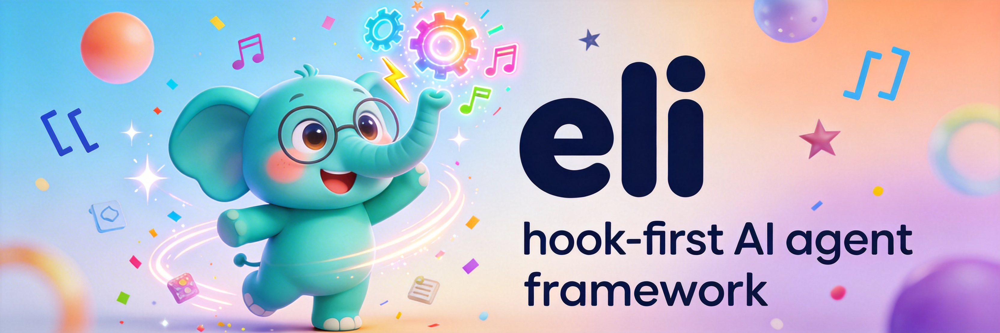
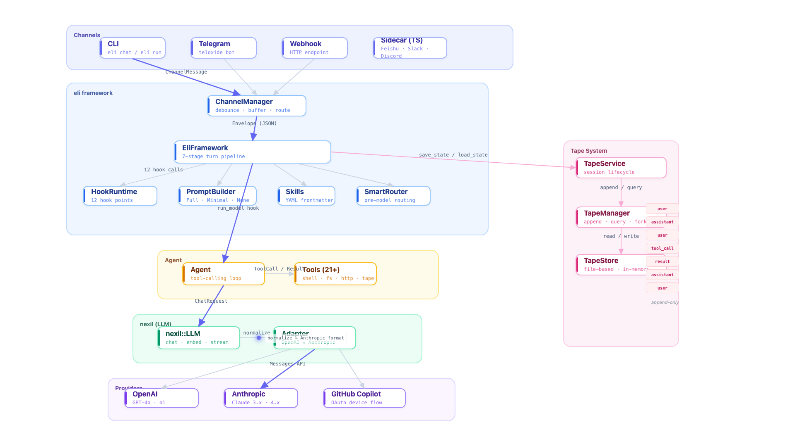

<p align="center">
  
</p>

# Eli — Ease Lives Instantly

> Open-source AI agent that lives in your group chat. WeChat, Feishu, Telegram, Slack, Discord — one command.

I needed an AI agent that could live in my team's group chat — not a chatbot, a teammate. Everything in the space was Python, couldn't deploy as a single binary, and fell apart the moment you needed real concurrency. So I built eli in Rust.

<!-- TODO: replace with actual recording via `vhs demo.tape` -->
```
$ eli chat
eli> summarize this repo in one paragraph

Eli is a hook-first AI agent framework written in Rust. It runs a 7-stage
turn pipeline (resolve_session → load_state → build_prompt → run_model →
save_state → render_outbound → dispatch_outbound) where every stage is a
hook point that plugins can override. It ships with 21 builtin tools, a
tape-based conversation history, and works across CLI, Telegram, and any
channel via an OpenClaw sidecar. The LLM layer (nexil) is provider-
agnostic — switch between OpenAI, Claude, Copilot, or Ollama with one
env var. The LLM layer is called nexil.

eli> /quit
```

## Why Eli?

|   | Eli | LangChain | CrewAI | AutoGen |
|---|-----|-----------|--------|---------|
| **Language** | Rust | Python | Python | Python |
| **Binary** | Single static binary | pip install + deps | pip install + deps | pip install + deps |
| **Architecture** | Hook pipeline (12 points) | Chain/graph | Role-based crew | Multi-agent conversation |
| **Extensibility** | Last-registered-wins hooks | Callbacks + chains | Custom agents | Custom agents |
| **Channels** | CLI, Telegram, Feishu, WeChat, Slack, Discord | None (library) | None (library) | None (library) |
| **Memory** | Tape (append-only, forkable) | Various memory classes | Shared memory | Chat history |
| **Deploy** | `cargo install` or Docker | Python environment | Python environment | Python environment |

Eli is smaller and younger. The tradeoff: you get Rust's performance, type safety, and single-binary deploys. If you want a mature ecosystem with hundreds of integrations, use LangChain. If you want a fast, self-contained agent that deploys anywhere and handles real concurrency, try eli.

## Quick Start

```bash
git clone https://github.com/cklxx/eli.git
cd eli && cargo build --release
cp env.example .env    # add your API key
```

```bash
eli chat                    # interactive REPL
eli run "summarize this"    # one-shot execution
eli gateway                 # multi-channel listener
```

## Features

- **丢进群聊就能用** — 微信、飞书、Telegram、Slack、Discord、DingTalk，一行命令接入，读上下文、调工具、群里直接回复
- **同时处理多件事** — 多个工具并行跑，复杂任务快很多
- **长聊天不断片** — 对话太长自动瘦身，关键信息不丢
- **干活时主动汇报** — 中途告诉你进展，不用干等到最后
- **能发图片** — 任何渠道都能发图，CLI 和群聊一样
- **换模型一行搞定** — OpenAI、Claude、Copilot、DeepSeek、Ollama，随时切
- **技能系统** — 用 Markdown 定义能力，项目级 / 全局可覆盖
- **单二进制部署** — `cargo install` 或 Docker，没有依赖地狱
- **MCP server** — 接入 Claude Code / Cursor 当工具用
- **自动上下文切换** — 接近 token 上限时自动分支，不打断对话

## Commands

| Command | Description |
|---------|-------------|
| `eli chat` | Interactive REPL with streaming output |
| `eli run "prompt"` | One-shot pipeline execution |
| `eli gateway` | Start channel listeners (Telegram, Webhook) |
| `eli login` | Authenticate with a provider (OpenAI, Claude, Copilot) |
| `eli model` | Switch model or list available models |
| `eli use` / `eli profile` | Switch provider profile |
| `eli status` | Show auth and config status |
| `eli tape` | Open tape viewer web UI |
| `eli decisions` | Manage persistent decisions |

## Gateway & Channels

```bash
# Telegram
ELI_TELEGRAM_TOKEN=xxx eli gateway

# Feishu / WeChat / DingTalk / Discord (via OpenClaw sidecar — auto-starts)
eli gateway
```

The sidecar launches a Node.js bridge that loads any OpenClaw channel plugin. First run prompts for credentials interactively.

## Architecture



> [**Interactive diagram**](https://cklxx.github.io/eli/#architecture) — click any module to explore &nbsp;|&nbsp; [**Video walkthrough**](https://github.com/cklxx/eli/blob/main/site/assets/architecture.mp4)

| Crate | Version | Role |
|-------|---------|------|
| **nexil** | 0.7.0 | Provider-agnostic LLM toolkit — streaming, tool calls, tape storage, embeddings, OAuth |
| **eli** | 0.4.0 | Hook-first agent framework — pipeline, channels, tools, skills, decisions |
| **eli-sidecar** | 0.2.0 | Node.js bridge — loads OpenClaw plugins, exposes channels + tools over HTTP or MCP |

## Configuration

| Variable | Default | Description |
|----------|---------|-------------|
| `ELI_MODEL` | `openai:gpt-4o-mini` | Model identifier (`provider:model`) |
| `ELI_API_KEY` | — | Provider API key |
| `ELI_API_BASE` | — | Custom API endpoint |
| `ELI_MAX_STEPS` | `50` | Max tool-use iterations per turn |
| `ELI_TELEGRAM_TOKEN` | — | Telegram bot token |
| `ELI_TELEGRAM_ALLOW_USERS` | — | Comma-separated user ID whitelist |
| `ELI_TELEGRAM_ALLOW_CHATS` | — | Comma-separated chat ID whitelist |
| `ELI_WEBHOOK_PORT` | `3100` | Webhook listener port |
| `ELI_HOME` | `~/.eli` | Config and data directory |
| `ELI_TRACE` | — | Enable structured trace logging (`1` / `true`) |

Profiles: `~/.eli/config.toml` — per-provider API keys and defaults.

## Skills

Skills are Markdown files with YAML frontmatter, discovered from:

1. `.agents/skills/<name>/SKILL.md` (project — highest priority)
2. `~/.eli/skills/<name>/SKILL.md` (global)
3. Sidecar-synthesized skills (from plugin tool groups)

## License

[Apache-2.0](./LICENSE)
